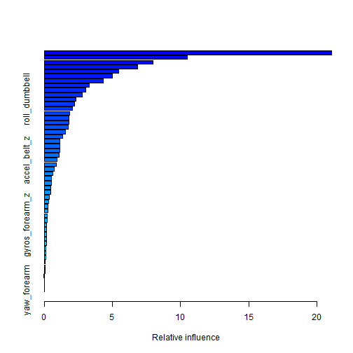

<!-- rmarkdown v1 -->
Personal Activity Prediction
========================================================
Using devices such as Jawbone Up, Nike FuelBand, and Fitbit it is now possible to collect a large amount of data about personal activity relatively inexpensively. These type of devices are part of the quantified self movement - a group of enthusiasts who take measurements about themselves regularly to improve their health, to find patterns in their behavior, or because they are tech geeks. One thing that people regularly do is quantify how much of a particular activity they do, but they rarely quantify how well they do it. 
In this project, my goal will be to use data from accelerometers on the belt, forearm, arm, and dumbell of 6 participants. They were asked to perform barbell lifts correctly and incorrectly in 5 different ways. More information is available from the website here: http://groupware.les.inf.puc-rio.br/har (see the section on the Weight Lifting Exercise Dataset).

## Data Loading

```r
setwd("C:/Users/HomeUser/Documents/Speciality Data Science/Practical Machine Learning/Projects/Personal-Activity-Prediction")
rawtrain <- read.csv("pml-training.csv", header = T
                    , sep=","
                        ,na.strings = c(NA,"","NA","<NA>")
                        #, comment.char = ""
                  )
rawtest <- read.csv("pml-testing.csv", header = T
                    , sep=","
                        ,na.strings = c(NA,"","NA","<NA>")
                        #, comment.char = ""
                  )
print(object.size(rawtrain),unit='Mb')
```

```
## 19 Mb
```

```r
# head(rawtrain)
# names(rawtrain)
# summary(rawtrain)
# str(rawtrain)
```

## PRE-PROCESSING

```r
library(caret)
```

```
## Loading required package: lattice
## Loading required package: ggplot2
```

```r
# discard unuseful variables

##NAs
NAs <- apply(rawtrain,2,function(x) {sum(is.na(x))}) #count NAs for each variable
###We capture indexes of all non-sensor variables
removeIndex <- grep("X|window|timestamp|user_name",names(rawtrain),value=F)

##Remove all together here

###If the quantity of NAs is superior to 10% for a variable, we drop this variable
fulltrain <- rawtrain[,-c(which(NAs > (10/100)*nrow(rawtrain)),removeIndex)] 
test <- rawtest[,-c(which(NAs > (10/100)*nrow(rawtrain)),removeIndex)]

##Split data into train + validation datas 
trainIndex <- createDataPartition(y = fulltrain$classe, p=0.7,list=FALSE)
part_training <- fulltrain[trainIndex,]
part_validating <- fulltrain[-trainIndex,]
```

## TRAINING

```r
set.seed(123)

# We choose a cross-validation of 4-folds instead of bootstrap default method for
# gradient boosting model (gbm) in order to speed up training.
fitControl <- trainControl(method = "cv", number = 4)

# We provide additionnal parameters to gbm, not far from default ones
gbmGrid <-  expand.grid(interaction.depth = 1:3,
                        n.trees = (1:4)*50,
                        shrinkage = 0.1
                        )

system.time(
        modFit <- train(fulltrain[trainIndex,]$classe ~. 
                        ,data = part_training
                        ,method="gbm"
                        ,trControl = fitControl
                        ,verbose = FALSE
                        ,tuneGrid = gbmGrid
                        )
        )
```

```
## Loading required package: gbm
## Loading required package: survival
## Loading required package: splines
## 
## Attaching package: 'survival'
## 
## The following object is masked from 'package:caret':
## 
##     cluster
## 
## Loading required package: parallel
## Loaded gbm 2.1
## Loading required package: plyr
```

```
##    user  system elapsed 
##  329.71    0.63  331.85
```

```r
# here model provide accuracy of 100% for the optimal model found by auto-tuning via cross-validation; This is the best out of bag error.
modFit
```

```
## Stochastic Gradient Boosting 
## 
## 13737 samples
##    52 predictors
##     5 classes: 'A', 'B', 'C', 'D', 'E' 
## 
## No pre-processing
## Resampling: Cross-Validated (4 fold) 
## 
## Summary of sample sizes: 10303, 10302, 10304, 10302 
## 
## Resampling results across tuning parameters:
## 
##   interaction.depth  n.trees  Accuracy  Kappa  Accuracy SD  Kappa SD
##   1                  50       0.8       0.7    0.01         0.01    
##   1                  100      0.8       0.8    0.01         0.01    
##   1                  200      0.9       0.8    0.005        0.007   
##   1                  200      0.9       0.8    0.004        0.005   
##   2                  50       0.9       0.8    0.009        0.01    
##   2                  100      0.9       0.9    0.004        0.005   
##   2                  200      0.9       0.9    0.003        0.004   
##   2                  200      0.9       0.9    0.002        0.002   
##   3                  50       0.9       0.9    0.005        0.007   
##   3                  100      0.9       0.9    0.003        0.004   
##   3                  200      1         0.9    0.003        0.004   
##   3                  200      1         1      0.003        0.003   
## 
## Tuning parameter 'shrinkage' was held constant at a value of 0.1
## Accuracy was used to select the optimal model using  the largest value.
## The final values used for the model were n.trees = 200,
##  interaction.depth = 3 and shrinkage = 0.1.
```

```r
modFit$finalModel
```

```
## A gradient boosted model with multinomial loss function.
## 200 iterations were performed.
## There were 52 predictors of which 49 had non-zero influence.
```

```r
summary(modFit)
```

 

```
##                                       var  rel.inf
## roll_belt                       roll_belt 21.10141
## pitch_forearm               pitch_forearm 10.48244
## yaw_belt                         yaw_belt  7.96103
## magnet_dumbbell_z       magnet_dumbbell_z  6.82828
## roll_forearm                 roll_forearm  5.48711
## magnet_dumbbell_y       magnet_dumbbell_y  4.98932
## magnet_belt_z               magnet_belt_z  4.31261
## pitch_belt                     pitch_belt  3.29360
## gyros_belt_z                 gyros_belt_z  3.06910
## accel_dumbbell_y         accel_dumbbell_y  2.80528
## roll_dumbbell               roll_dumbbell  2.32060
## magnet_forearm_z         magnet_forearm_z  2.20460
## gyros_dumbbell_y         gyros_dumbbell_y  2.08708
## accel_forearm_x           accel_forearm_x  1.89135
## accel_dumbbell_x         accel_dumbbell_x  1.83107
## magnet_dumbbell_x       magnet_dumbbell_x  1.82514
## accel_forearm_z           accel_forearm_z  1.75988
## yaw_arm                           yaw_arm  1.54565
## roll_arm                         roll_arm  1.34116
## magnet_belt_y               magnet_belt_y  1.14645
## magnet_arm_z                 magnet_arm_z  1.12494
## magnet_belt_x               magnet_belt_x  1.12442
## magnet_forearm_x         magnet_forearm_x  1.09631
## accel_belt_z                 accel_belt_z  0.96075
## accel_dumbbell_z         accel_dumbbell_z  0.87090
## magnet_arm_x                 magnet_arm_x  0.74023
## accel_arm_x                   accel_arm_x  0.62963
## total_accel_forearm   total_accel_forearm  0.55760
## gyros_arm_y                   gyros_arm_y  0.51687
## magnet_arm_y                 magnet_arm_y  0.49215
## gyros_dumbbell_x         gyros_dumbbell_x  0.46713
## gyros_belt_y                 gyros_belt_y  0.37573
## yaw_dumbbell                 yaw_dumbbell  0.30409
## accel_belt_y                 accel_belt_y  0.29636
## total_accel_dumbbell total_accel_dumbbell  0.28098
## accel_arm_z                   accel_arm_z  0.22495
## pitch_dumbbell             pitch_dumbbell  0.21013
## gyros_forearm_z           gyros_forearm_z  0.18942
## gyros_forearm_y           gyros_forearm_y  0.18364
## gyros_dumbbell_z         gyros_dumbbell_z  0.17291
## gyros_arm_x                   gyros_arm_x  0.16854
## accel_forearm_y           accel_forearm_y  0.16112
## accel_arm_y                   accel_arm_y  0.12895
## magnet_forearm_y         magnet_forearm_y  0.11150
## total_accel_belt         total_accel_belt  0.09783
## total_accel_arm           total_accel_arm  0.07896
## gyros_forearm_x           gyros_forearm_x  0.06482
## pitch_arm                       pitch_arm  0.04644
## gyros_belt_x                 gyros_belt_x  0.03954
## accel_belt_x                 accel_belt_x  0.00000
## gyros_arm_z                   gyros_arm_z  0.00000
## yaw_forearm                   yaw_forearm  0.00000
```

```r
#VALIDATING MODEL
pred.part_validating <- predict(modFit,part_validating)
```
Here cross-validation provide accuracy of 97.4% for our model:
this is the expected out of sample error

```r
confusionMatrix(pred.part_validating, part_validating$classe)
```

```
## Confusion Matrix and Statistics
## 
##           Reference
## Prediction    A    B    C    D    E
##          A 1651   25    0    0    0
##          B   11 1093   26    1    6
##          C    7   19  992   16    7
##          D    3    1    8  939   11
##          E    2    1    0    8 1058
## 
## Overall Statistics
##                                        
##                Accuracy : 0.974        
##                  95% CI : (0.97, 0.978)
##     No Information Rate : 0.284        
##     P-Value [Acc > NIR] : < 2e-16      
##                                        
##                   Kappa : 0.967        
##  Mcnemar's Test P-Value : 0.000364     
## 
## Statistics by Class:
## 
##                      Class: A Class: B Class: C Class: D Class: E
## Sensitivity             0.986    0.960    0.967    0.974    0.978
## Specificity             0.994    0.991    0.990    0.995    0.998
## Pos Pred Value          0.985    0.961    0.953    0.976    0.990
## Neg Pred Value          0.995    0.990    0.993    0.995    0.995
## Prevalence              0.284    0.194    0.174    0.164    0.184
## Detection Rate          0.281    0.186    0.169    0.160    0.180
## Detection Prevalence    0.285    0.193    0.177    0.163    0.182
## Balanced Accuracy       0.990    0.975    0.978    0.985    0.988
```

```r
#TESTING MODEL
pred.test <- predict(modFit,test)

#Predicted values on the test set:
pred.test
```

```
##  [1] B A B A A E D B A A B C B A E E A B B B
## Levels: A B C D E
```
